# Web-Stack-Project
Implementing a web stack through AWS EC2 instance
WEB STACK IMPLEMENTATION

Before getting started, I had to familiarize myself with the different web development STACKS  as well as the meaning of SDLC. 

A technology stack is a set of frameworks and tools used to develop a software product. These set of frameworks and tools are specifically chosen to work together in creating a well-functioning software. They are acronyms for individual technologies used together for a specific technology product. Some examples are:

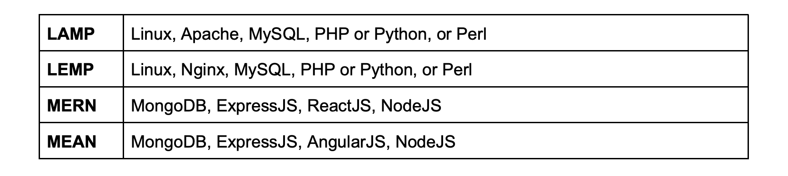

SDLC is an acronym that means Software Development Life Cycle. SDLC is a systematic that is used by development teams to help them to effectively produce high quality software. The 7 phases of SDLC are:

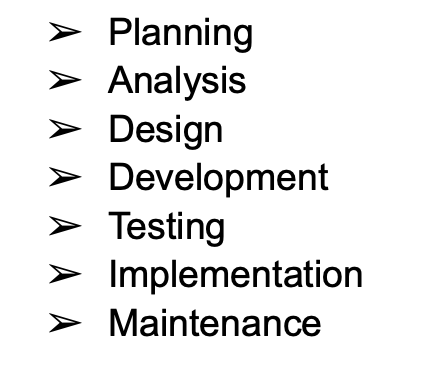

Project Objectives:

* Become very confident on the Linux Terminal.
* Deepen your understanding of Web Stacks and familiarity between the differences between the different Web Technology stacks such as LAMP, LEMP, MEAN, and MERN stacks
* Solid Linux administration skills in Storage management, NFS, troubleshooting, and basic networking.
 * Basic knowledge of AWS platform and components used to host a Website of various Web stacks.

Getting Started:

This project will be utilizing the AWS Cloud platform. Therefore, to get started on this project, one must have an AWS account. You can select any plan that fits your needs. I used the Free Tier Plan for this project. Click/Copy and paste the following link for a video on how to register for an AWS account: https://www.youtube.com/watch?v=v3WLJ_0hnOU

The following steps will explain how to create your first Instance. 

1. Sign-in to your AWS Cloud Account as the Root user.

2. Create an EC2 instance. Refer to the image for instructions on how to create an instance.
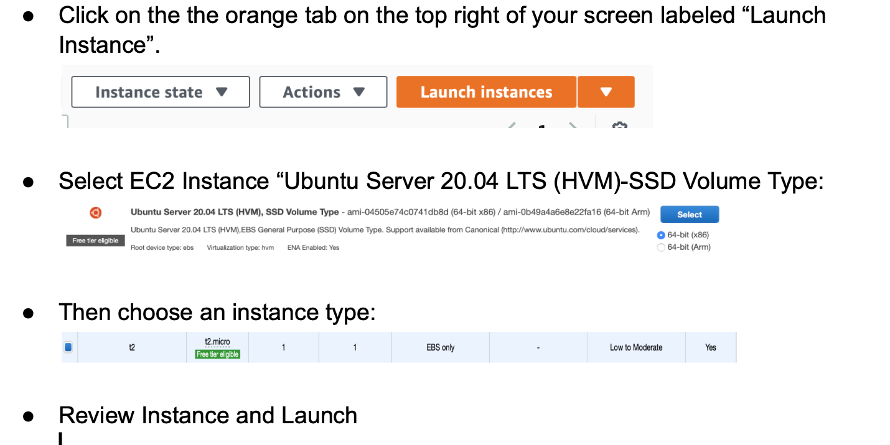

Use this link for a visual aid on how to create a free EC2 Instance in AWS with Ubuntu 20.04 LTS: https://www.youtube.com/watch?v=a8CBE_WN7rA

IMPORTANT - save your private key (.pem file) securely and do not share it with anyone! If you lose it, you will not be able to connect to your server ever again!

3. Connect  local machine to EC2 instance. 

*For Windows users, you will need a tool called putty to connect to your EC2 Instance. Click on the following link for instructions on how to download Putty click on this link https://www.putty.org

*For Mac users, you can simply open up Terminal and use the ssh command to get into the server.
-Change directory into the location where your PEM file is. In this case my PEM file was in my Downloads folder.
* $cd ~/Downloads
* Change permissions for the private key file (.pem), otherwise you can get an error “Bad permissions”. Use this command $ sudo chmod 0400 <private-key-name>.pem
* Connect to the instance by running this command 
$ ssh -i <private-key-name>.pem ubuntu@<Public-IP-address>
* The Linux server in the cloud has just been created and should look like the following :
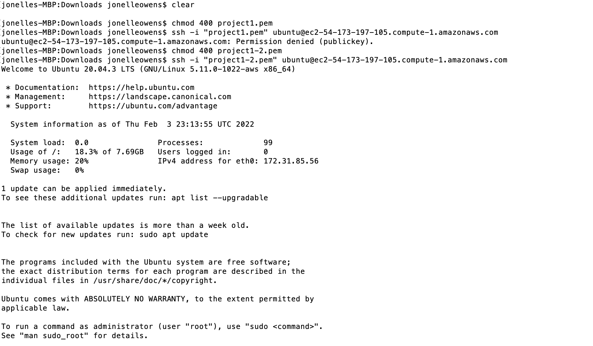

STEP 1- Installing Apache and Updating the Firewall

* Install Apache using Ubuntu’s package manager ‘apt’:
* Update a list of packages in package manager $ sudo apt update
* Run apache2 package installation $ sudo apt install apache2
* To verify that apache2 is running as a Service in our OS, use following   command $ sudo systemctl status apache2
* If it is green and running that it was done correctly.
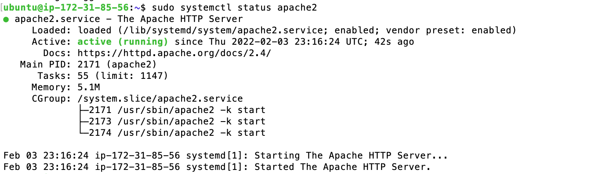

Before we can receive any traffic by our Web Server, we need to open TCP port 80 which is the default port that web browsers use to access web pages on the Internet.
As we know, we have TCP port 22 open by default on our EC2 machine to access it via SSH, so we need to add a rule to EC2 configuration to open inbound connection through port 80.
Click on the following link for instructions on how to add a rule to the EC2 inbound connection through port 80: https://www.youtube.com/watch?v=FMcJ2OGaaP0
* To access locally, run this command
$ curl http://localhost:80  or  $ curl http://127.0.0.1:80 
* To test how Apache HTTP server can respond to requests from the Internet, open a web browser of your choice and try accessing the following url
http://Public-IP-Address:80 (note: insert your EC2 IP Address between the <>)
* If you see following page, then your web server is now correctly installed and accessible through your firewall.
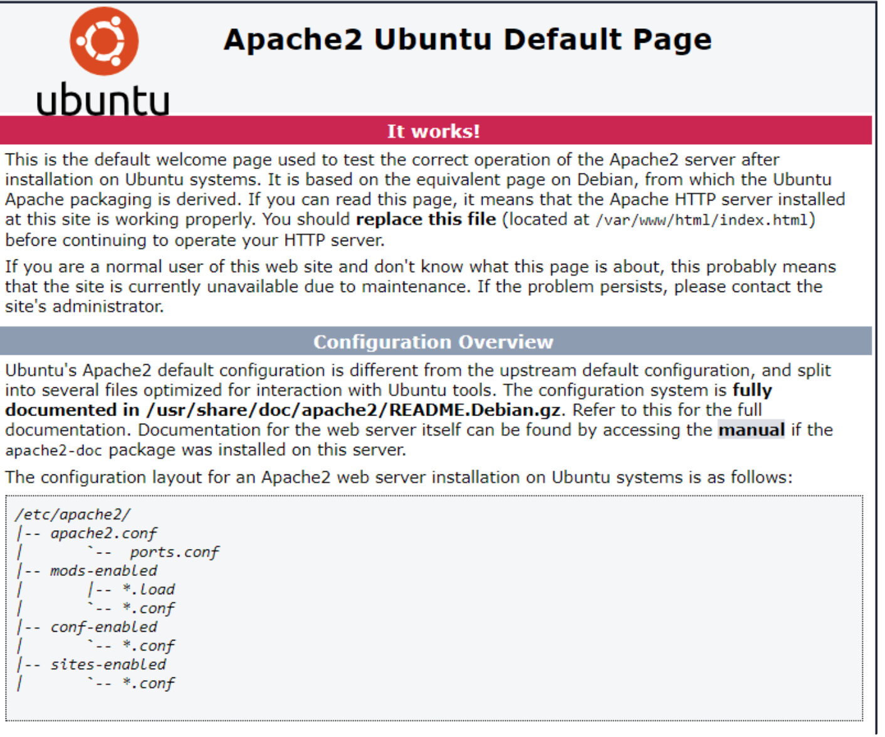

STEP 2 - Installing MySQL

We will be using ‘apt’ again to install the MySQL software.

Now that  the web server is up and running, the next step will be to install a Database Management System (DBMS) to be able to store and manage data for your site in a relational database. We will be using  MySQL since it is a popular relational database management system used within PHP environments.
* Start with command: $ sudo apt install mysql-server
* When prompted, confirm installation by typing Y, and then ENTER.
* When the installation is finished, it’s recommended that you run a security script that comes pre-installed with MySQL. This script will remove some insecure default settings and lock down access to your database system. Start the interactive script by running: $ sudo mysql_secure_installation
* This will ask if you want to configure the VALIDATE PASSWORD PLUGIN. 
Note: You can leave validation disabled, but you should always use a strong password for database capabilities. 
* Answer Y for yes, or anything else to continue without enabling.
* Validate password plugin which is used to test the strength of the password and allows the users to set said passwords. Would you like to setup validate password plugin?
* Press y|Y for Yes, any other key for No:`
(If you answer “yes”, you’ll be asked to select a level of password validation. Keep in mind that if you enter 2 for the strongest level, you will receive errors when attempting to set any password which does not contain numbers, upper and lowercase letters, and special characters, or which is based on common dictionary words.)
* Press Y and hit the Enter key for the rest of the questions.
*When you have finished, test if you’re able to log in to the MySQL console by typing: $ sudo mysql

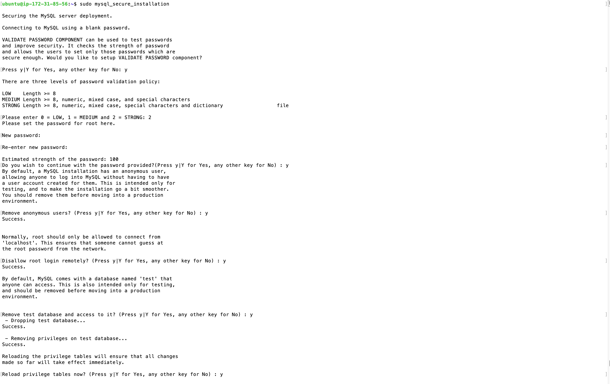

*This will connect to the MySQL server as the administrative database user root, which is inferred by the use of sudo when running this command. You should see output like this:

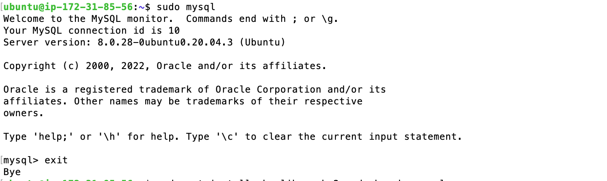

* Run command mysql> exit 

STEP 3 - Installing PHP

This final installation of PHP will complete the LAMP stack installing and will now be functional. 

Why is PHP important? PHP is the component of our setup that will process code to display dynamic content to the end user. In addition to the php package, you’ll need php-mysql, a PHP module that allows PHP to communicate with MySQL-based databases. You’ll also need libapache2-mod-php to enable Apache to handle PHP files. Core PHP packages will automatically be installed as dependencies.

* To install these 3 packages at once, run: 
$ sudo apt install php libapache2-mod-php php-mysql
* Once the installation is finished, you can run the following command to confirm your PHP version: $ php -v

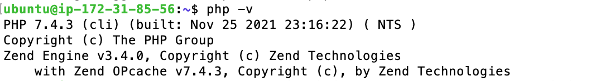

Lamp Stack is complete!
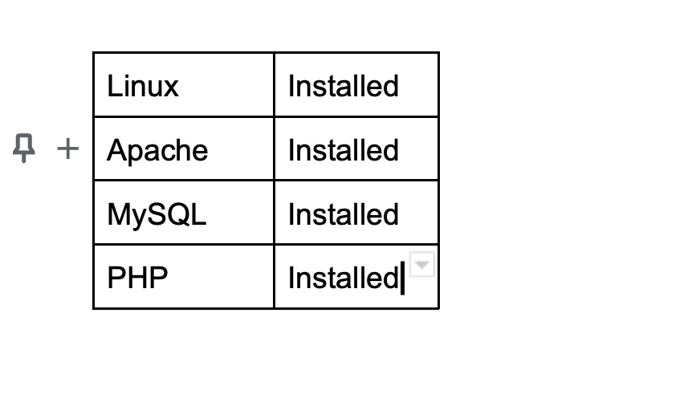

STEP 4 - Creating A Virtual Host for Your Website Using Apache

I created a domain called, PROJECTLAMP, for this project. 

Apache on Ubuntu 20.04 has one server block enabled by default that is configured to serve documents from the /var/www/html directory. We will leave this configuration as is and will add our own directory to the next default one.

* Create the directory for projectlamp using ‘mkdir’ command as follows:
$ sudo mkdir /var/www/projectlamp
* Next, assign ownership of the directory with the  USER environment variable, which will reference your current system user:
$ sudo chown -R $USER:$USER /var/www/projectlamp
* Then, create and open a new configuration file in Apache’s sites-available directory using your preferred command-line editor. Here, we’ll be using vi:
$ sudo vi /etc/apache2/sites-available/projectlamp.conf

 * Paste in the following bare-bones configuration by hitting on i on the keyboard to enter the insert mode, and paste the text:
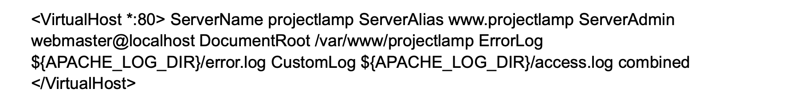
* Hit the esc button
* Type :wq!  and then hit enter to save the file and quite. (w = write and q =quit)
* Now, I have exited out of the vi editor and have returned to my terminal screen, which should look like this:

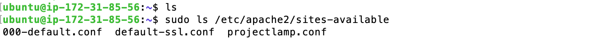

(With this VirtualHost configuration, we’re telling Apache to serve projectlamp using /var/www/projectlampl as its web root directory. If you would like to test Apache without a domain name, you can remove or comment out the options ServerName and ServerAlias by adding a # character in the beginning of each option’s lines. Adding the # character there will tell the program to skip processing the instructions on those lines.)

* You can now use a2ensite command to enable the new virtual host:
$ sudo a2ensite projectlamp
* You might want to disable the default website that comes installed with Apache. This is required if you’re not using a custom domain name, because in this case Apache’s default configuration would overwrite your virtual host. To disable Apache’s default website use a2dissite command , type: $ sudo a2dissite 000-default
* To make sure your configuration file doesn’t contain syntax errors, run: 
$ sudo apache2ctl configtest
* Finally, reload Apache so these changes take effect: $ sudo systemctl reload apache2

* Hurray! Your new website is now active, but the web root /var/www/projectlamp is still empty. Create an index.html file in that location so that we can test that the virtual host works as expected:
sudo echo 'Hello LAMP from hostname' $(curl -s <http://169.254.169.254/latest/meta-data/public-hostname>) with public IP $(curl -s <http://169.254.169.254/latest/meta-data/public-ipv4>) > /var/www/projectlamp/index.html
* Now go to your browser and try to open your website URL using IP address:
http://<Public-IP-Address>:80
* If you see the text from ‘echo’ command you wrote to index.html file, then it means your Apache virtual host is working as expected. In the output you will see your server’s public hostname (DNS name) and public IP address. You can also access your website in your browser by public DNS name, not only by IP - try it out, the result must be the same (port is optional): http://<Public-DNS-Name>:80

Step 5 — Enable PHP on the website

With the default DirectoryIndex settings on Apache, a file named index.html will always take precedence over an index.php file. This is useful for setting up maintenance pages in PHP applications by creating a temporary index.html file containing an informative message to visitors. Because this page will take precedence over the index.php page, it will then become the landing page for the application. Once maintenance is over, the index.html is renamed or removed from the document root, bringing back the regular application page.
* In case you want to change this behavior, you’ll need to edit the /etc/apache2/mods-enabled/dir.conf file and change the order in which the index.php file is listed within the DirectoryIndex directive:
$ sudo vim /etc/apache2/mods-enabled/dir.conf
* type i for insert and write:
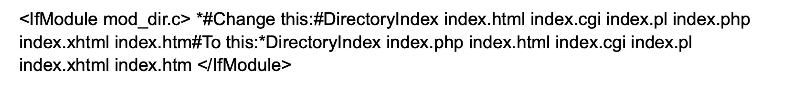

* After saving and closing the file :wq!, you will need to reload Apache so the changes take effect: $ sudo systemctl reload apache2
* Finally, we will create a PHP script to test that PHP is correctly installed and configured on your server.

Now that you have a custom location to host your website’s files and folders, we’ll create a PHP test script to confirm that Apache is able to handle and process requests for PHP files.
* Create a new file named index.php inside your custom web root folder:
$ vim /var/www/projectlamp/index.php
* This will open a blank file. Add the following text, which is valid PHP code, inside the file:

 * ?php phpinfo();
* When you are finished, save and close the file, refresh the page and you will see a page similar to this:

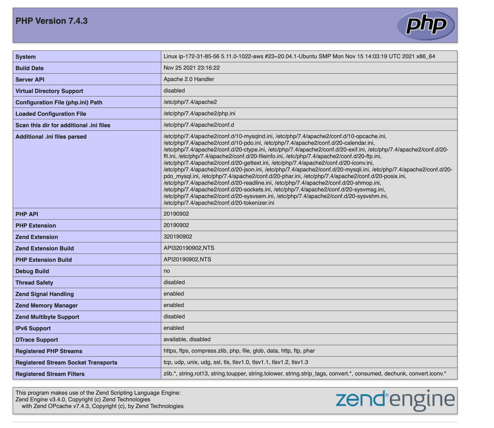
VOILA!

				
